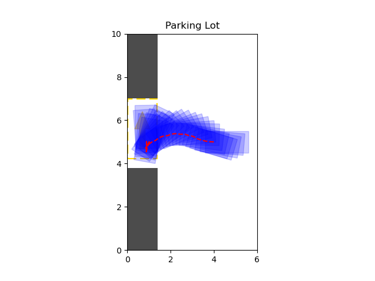
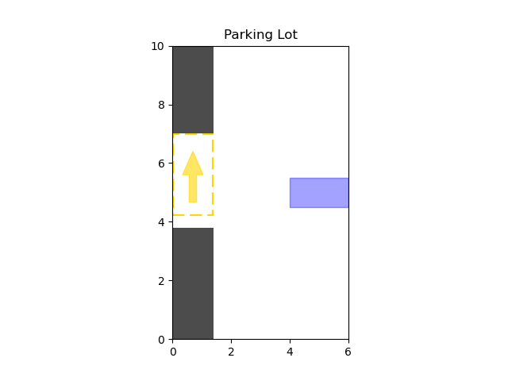

# Automatic Parking

This project implements an algorithm for automatic parking, 
specifically designed for four-wheeled vehicles with front-wheel steering.

## Simulation Configuration

### Vehicle Model

The vehicle is modeled with [Ackermann steering geometry](https://en.wikipedia.org/wiki/Ackermann_steering_geometry), 
the origin $`O`$ is chosen to be the center of the rear axle,
because the center of the turning circle always lies on the extension of the rear axle. 

<p align="center"></p>

<!-- ### Kinematic Equations of The Vehicle

```math
\left\{\begin{align*}
\dot{x} &= v \cos(\varphi)\\
\dot{y} &= v \sin(\varphi)\\
\dot{v} &= a\\
\dot{\varphi} &= \frac{v}{L}\tan(\theta)\\
\dot{\theta} &= \omega
\end{align*}\right.
```

The changing rate of the turning angle $`\left|\omega\right| < 1 \ \mathrm{rad\!\cdot\! s^{-1}}`$. -->

### Simulation Environment

The ([configuration file](./src/utils/test_parking_lot.toml)) defines a test scene.
You can configure field dimensions, grid resolution, obstacles, vehicle properties, start and goal poses,
and planner parameters, etc.

Feel free to add new configuration files or edit the existing one.

## Usage

In the repository directory:
```bash
cd ./src
```

To run the simulation:
```bash
python main.py
```
You can change the scene setup and configurations in `src/utils/test_parking_lot.toml`
or create a new configuration file.

To get the shortest Reeds-Shepp curve from one point to another, run:
```bash
cd ./models
python reeds_shepp.py [-h] [-s X Y PHI] -g X Y PHI [-r RADIUS]
```
For example, `python reeds_shepp.py -g 2 1 90 -s 4 0 0 -r 1.5` 
computes the shortest Reeds-Shepp path from $(4, 0, 0^\circ)$
to $(2, 1, 90^\circ)$, with the minimum turning radius $1.5$.
The `-g` parameter is necessary, while `-s` and `-r` are emittable, 
their default values are $(0, 0, 0^\circ)$ and $1$, respectively.

In the [plots](#reeds-shepp-curve), the blue paths indicate the car is moving forward, while the red paths indicate the car is reversing.


## Demos

### Path finding

<p float="left">


</p>

<p float="left">


</p>

<p float="left">


</p>

<p float="left">


</p>

### Reeds-Shepp curve

<p float="left">


</p>
