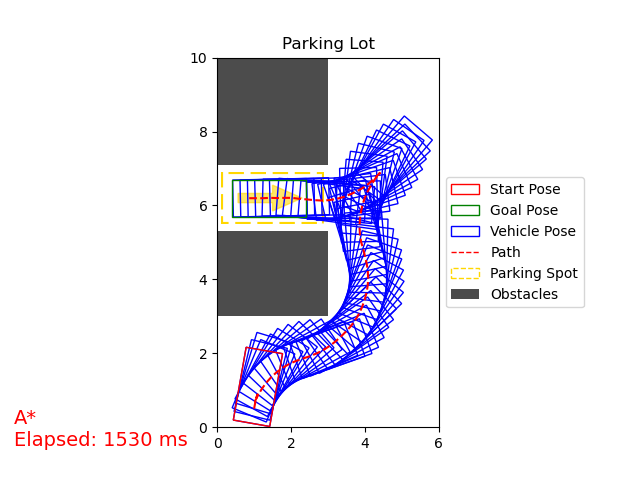

# Automatic Parking

This project is for path-planning, 
specifically designed for four-wheeled vehicles with front-wheel steering.
A* and RRT* path-finding algorithms are implemented, 
some modules are written in C++ to improve performance.

## Simulation Configuration

### Vehicle Model

The vehicle is modeled with [Ackermann steering geometry](https://en.wikipedia.org/wiki/Ackermann_steering_geometry), 
the origin $`O`$ is chosen to be the center of the rear axle,
because the center of the turning circle always lies on the extension of the rear axle. 

<p align="center"></p>

<!-- ### Kinematic Equations of The Vehicle

```math
\left\{\begin{align*}
\dot{x} &= v \cos(\varphi)\\
\dot{y} &= v \sin(\varphi)\\
\dot{v} &= a\\
\dot{\varphi} &= \frac{v}{L}\tan(\theta)\\
\dot{\theta} &= \omega
\end{align*}\right.
```

The changing rate of the turning angle $`\left|\omega\right| < 1 \ \mathrm{rad\!\cdot\! s^{-1}}`$. -->

### Simulation Environment

The [configuration file](./scripts/utils/test_parking_lot.toml) defines a test scene.
You can configure field dimensions, grid resolution, obstacles, vehicle properties, start and goal poses,
and planner parameters, etc.

Feel free to add new configuration files or edit the existing one.

## Usage

You can change the scene setup and configurations in `scripts/utils/test_parking_lot.toml`
or create a new configuration file.

To run the simulation, you need `python >= 3.11`, `numpy`, `matplotlib` and `toml`
```bash
cd ./scripts
python main.py
```
You will notice the following warnings:
```
WARNING:[algorithms.astar_search]:C++ library _reeds_shepp not found! Using fallback Python module: reeds_shepp
WARNING:[algorithms.astar_search]:C++ library _reeds_shepp not found! Using fallback Python module: occupancy_map
```
To use C++ libraries, you need to [compile these libraries](compile-c++-components), 
and copy the shared library files (for example `_reeds_shepp.cpython-312-x86_64-linux-gnu.so`) to `scripts/models/`. 
It is recommended to use the C++ modules, since they are significantly faster than the python counterparts.

To get the shortest Reeds-Shepp curve from one point to another, run:
```bash
cd ./scripts/models
python reeds_shepp.py [-h] [-s X Y PHI] -g X Y PHI [-r RADIUS]
```
For example, `python reeds_shepp.py -g 2 1 90 -s 4 0 0 -r 1.5` 
computes the shortest Reeds-Shepp path from $(4, 0, 0^\circ)$
to $(2, 1, 90^\circ)$, with the minimum turning radius $1.5$.
The `-g` parameter is necessary, while `-s` and `-r` are emittable, 
their default values are $(0, 0, 0^\circ)$ and $1$, respectively.

In the [plots](#reeds-shepp-curve), the blue paths indicate the car is moving forward, while the red paths indicate the car is reversing.

### Compile C++ Components

All C++ modules are placed in `./src/`, 
currently there are 2 C++ modules: `reeds_shepp_cpp` and `occupancy_map_cpp`.
The compilations of them have the same steps, `occupancy_map_cpp` will be used as an example.

First change directory into one of the C++ project directories.
```bash
cd ./src/occupancy_map_cpp
```
In the `CMakeLists.txt`, edit the line to specify your python executable to use.
The python version should be the same as that you use to run `main.py`.
```cmake
set (PYTHON_EXECUTABLE "path/to/your/python/executable")
```
Make sure you have CMake installed and properly configured, and
```bash
mkdir build && cd build
cmake ..
make
```
The target file is `_occupancy_map.*.so` for Linux and macOS and `_occupancy_map.*.dll` for Windows. Upon successful compilation, the generated binary file will be copied to `scripts/models`.


## Demos

### A* Path finding

<p float="left">


</p>

<p float="left">


</p>

<p float="left">


</p>

### RRT* Path finding (Time Budget $200\ \mathrm{ms}$)

<p float="left">


</p>

<p float="left">


</p>

<p float="left">


</p>

### Reeds-Shepp curve

<p float="left">


</p>
